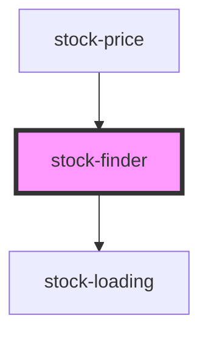

# stock-finder

<!-- Auto Generated Below -->

## Properties

| Property      | Attribute      | Description | Type     | Default     |
| ------------- | -------------- | ----------- | -------- | ----------- |
| `stockSymbol` | `stock-symbol` |             | `string` | `undefined` |

## Events

| Event                | Description | Type                  |
| -------------------- | ----------- | --------------------- |
| `stockSymbolChanged` |             | `CustomEvent<string>` |

## Dependencies

### Used by

 - [stock-price](../stock-price)

### Depends on

- [stock-loading](../loading-stock)

### Graph

----------------------------------------------

*Built with [StencilJS](https://stenciljs.com/)*
